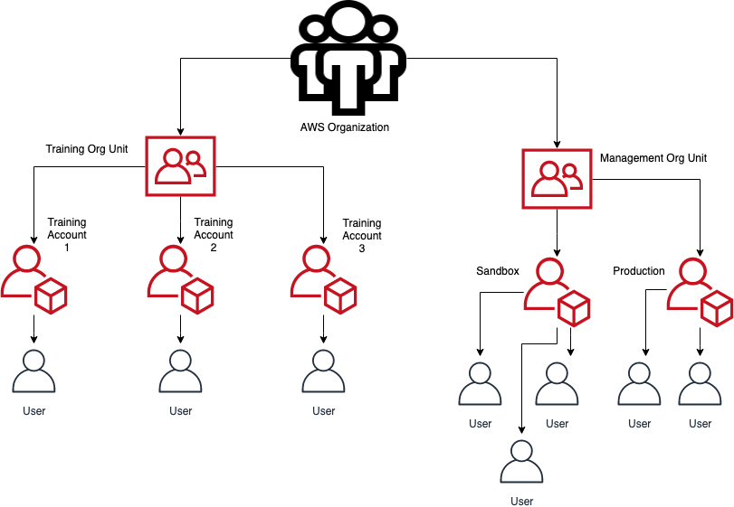

# AWS-Nuke for Multiple Accounts

This project provides a method of automating the [AWS-Nuke]() tool into multiple accounts.

**First and Final Warning:** _This is a dangerous and very destructive tool and should not be deployed without fully understanding the impact it **will** have on the accounts you allow it to interface with._

This tool was built with a specific organizational architecture in mind. See below for a visual overview. Specifically, take note that all training accounts are located withing a parent organziational unit, isolated from any other accounts in the organization.




## Important Note about Production Readiness

By default this tool is configured to **NOT** be destructive, which follows a similar pattern to the AWS-Nuke tool's default behaviors. When deploying to Production, you need to modify the deployment code to allow AWS-Nuke to destroy resources on your behalf. See below for how and what to modify for Production:
```bash
### NukeStack.yaml (DEFAULT) ###
### Approx Line: 147/148 ###

# TODO: Add --no-dry-run flag for Production
aws-nuke -c $line.yaml --force --access-key-id $ACCESS_KEY_ID --secret-access-key $SECRET_ACCESS_KEY --session-token $SESSION_TOKEN |tee -a aws-nuke.log;
```
Below is the Production code which needs to be in place for actually destroying resources in accounts:
```bash
### NukeStack.yaml (PRODUCTION) ###
### Approx Line: 147/148 ###

# TODO: Add --no-dry-run flag for Production
aws-nuke -c $line.yaml --force --no-dry-run --access-key-id $ACCESS_KEY_ID --secret-access-key $SECRET_ACCESS_KEY --session-token $SESSION_TOKEN |tee -a aws-nuke.log;
```

## Prerequisites

1. [AWS CLI](https://docs.aws.amazon.com/cli/latest/userguide/cli-chap-install.html)
1. A **firm** understanding of AWS, and access to your organization's accounts
1. A Role in each account to be cleaned that allows this CodeBuild Project to Assume permissions within the account. This Role needs to be consistently named across all affected accounts, as it's a parameter necessary for the CloudFormation template to run properly.

## Setup and Installation

1. Clone the repo
    ```bash
    git clone https://github.com/1Strategy/automated-aws-multi-account-cleanup.git
    cd automated-aws-multi-account-cleanup
    ```
1. Determine the ID of the Organizational Unit that owns the grouping of accounts that you would like to cleanse with AWS-Nuke.
    - Log into your AWS Account, and access the [Organizations console](https://console.aws.amazon.com/organizations/home) to access the information regarding your organizational account structure.
    - _Note: You will need permissions to view this information_
1. Update your config file with specific filters for your accounts
    - _Note: It will be helpful to run aws-nuke locally a single account to ensure you have a firm grasp on resources that you would like to retain, such as roles for Administrator role assumption, **as well as resources which will be destroyed**._
1. Run AWS-Nuke against one of your accounts with your updated config file to test the output.
    - _Note: By default, this is non-destructive._
    ```bash
    # Example aws-nuke command (you will need to modify the config file, line 29, with an account number to run against) and subsequent output
    aws-nuke -c ./aws-nuke-config --profile sandbox

    Assume Role MFA token code: 000000
    aws-nuke version v2.9.0 - Wed Mar 27 15:19:23 UTC 2019 - 0df913de92ab8f81646f06bfd0eadba0f42d722c

    Do you really want to nuke the account with the ID 000000000000 and the alias 'my-account-alias'?
    Do you want to continue? Enter account alias to continue.
    > my-account-alias

    global - IAMRole - AWSCloudFormationStackSetExecutionRole - filtered by config
    global - IAMRole - AWSServiceRoleForOrganizations - cannot delete service roles
    global - IAMRole - AWSServiceRoleForRDS - cannot delete service roles
    global - IAMRole - AWSServiceRoleForSupport - cannot delete service roles
    global - IAMRole - AWSServiceRoleForTrustedAdvisor - cannot delete service roles
    ...
    ...
    ...
    Scan complete: 104 total, 4 nukeable, 100 filtered.

    The above resources would be deleted with the supplied configuration. Provide --no-dry-run to actually destroy resources.
    ```
1. The tool is currently configured to run at 12:00a PST Mon-Fri. It can be easily configured with a `rate()` or `cron()` expression by editing the [NukeStack.yaml](./Nukestack.yaml) file in the `CloudWatchNukeScriptSchedule:Properties:ScheduleExpression:` section.
1. Create an S3 Bucket and upload your `aws-nuke-config.yaml` file
    ```bash
    aws s3 mb s3://some-new-unique-bucket
    aws s3 cp ./aws-nuke-config.yaml s3://some-new-unique-bucket
    ```
1. Deploy to production via aws cloudformation cli
    ```bash
    aws cloudformation deploy \
    --profile production \
    --stack-name AccountNukeStack \
    --template-file NukeStack.yaml \
    --parameter-overrides \
        ParentOuId=0-abcd1234 \
        BucketName=some-new-unique-bucket \
        AssumeRoleName=NukeRole
    ```
1. Retrieve the status of your stack
    - Check the status of your build once:
    ```bash
    aws cloudformation describe-stacks \
    --profile production \
    --stack-name AccountNukeStack \
    --query "Stacks[*].StackStatus"
    ```
    - Or watch the status of your build over 5sec intervals:
    ```bash
    watch -n 5 -d 'aws cloudformation describe-stacks
    --profile production
    --stack-name AccountNukeStack
    --query "Stacks[*].StackStatus"'
    ```

## Removal

1. Use aws cloudformation cli to remove the stack and all associated resources
    ```bash
    aws cloudformation delete-stack --stack-name AccountNukeStack
    ```

## License

Licensed under the Apache License, Version 2.0.
